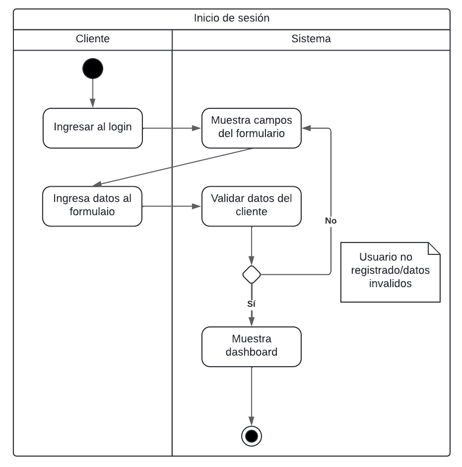
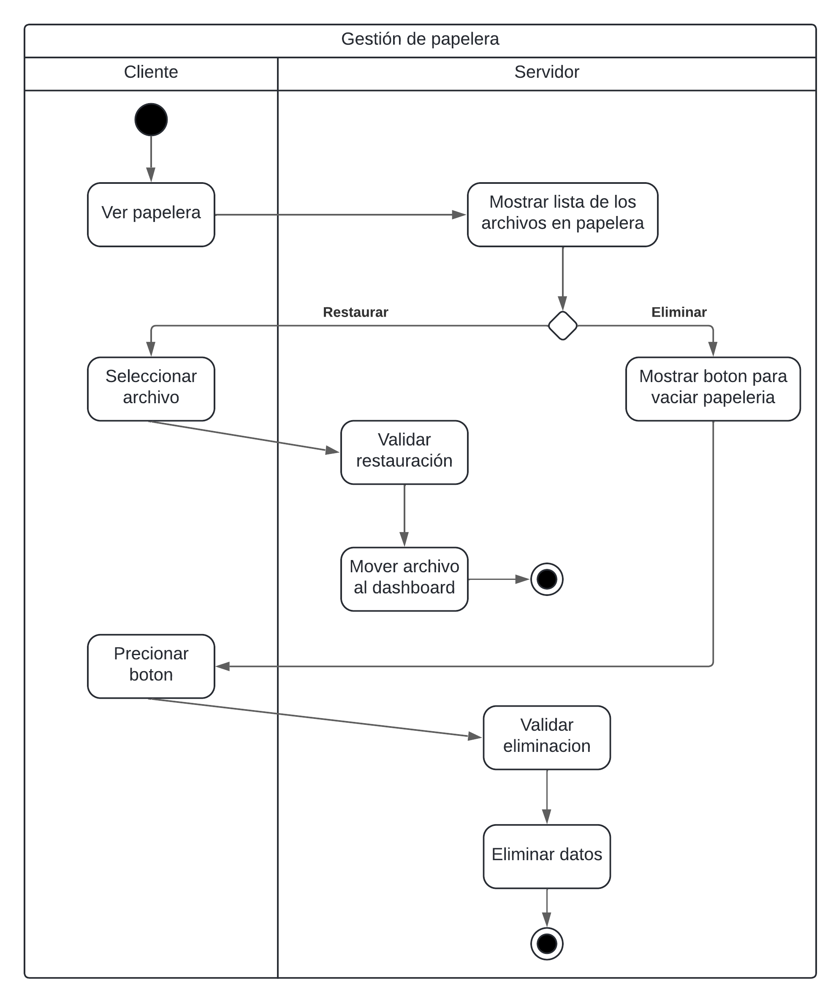

# Proyecto Fase1

## Descripción de la metodología de desarrollo: SCRUM

Scrum es una metodología ágil para gestionar proyectos que se centra en la entrega continua de valor y en adaptarse a los cambios a medida que avanzas. Funciona a través de ciclos de trabajo cortos, conocidos como sprints (ciclos de trabajo), que suelen durar entre 2 y 4 semanas. Durante cada sprint, el equipo de desarrollo se enfoca en completar un conjunto específico de tareas, que están basadas en una lista de requisitos y funcionalidades del proyecto.

Scrum incluye varios elementos clave para asegurar un flujo de trabajo efectivo. Primero, en la planificación del sprint, el equipo establece los objetivos y define qué tareas se abordarán. Las reuniones diarias, o daily stand-ups, permiten a todos los miembros del equipo mantenerse alineados y resolver problemas rápidamente. Al final de cada sprint, se realiza una revisión para mostrar el trabajo completado y obtener feedback de los stakeholders. Finalmente, la retrospectiva del sprint brinda al equipo la oportunidad de reflexionar sobre lo que funcionó bien y lo que puede mejorar, ayudando a optimizar el proceso para futuros sprints.

### Justificacion

Para el proyecto “AYD - Storage”, la metodología Scrum es una excelente elección debido a su enfoque en la adaptación continua y la entrega gradual de valor, ya que el proyecto es por fases, donde los requisitos pueden cambiar y evolucionar con el tiempo, Scrum ofrece la flexibilidad necesaria para ajustar las prioridades a medida que surgen nuevas necesidades. Esto es crucial para mantener el desarrollo en sintonía con los objetivos del proyecto y las expectativas del cliente.

La estructura de trabajo en ciclos cortos, facilita la entrega constante de partes funcionales del proyecto. Al final de cada sprint, se revisa el progreso y se pueden realizar ajustes en función del feedback recibido. Esto asegura que los requisitos del proyecto este alineado y permite hacer correcciones antes de que esté terminado, reduciendo el riesgo de desvíos significativos del objetivo original.

Además, Scrum fomenta una comunicación abierta y una mejora continua dentro del equipo. Las reuniones diarias, son clave para asegurar que todos estén alineados y para identificar problemas rápidamente. Este enfoque colaborativo ayuda a minimizar los riesgos y a mantener el proyecto en el buen camino.

## Modelo de branching

**Git Flow**

El flujo de Git se utilizo para el desarrollo de características y lanzamientos. La rama master contiene el código listo para producción, mientras que la rama develop es donde se desarrollan nuevas características. Cuando una característica está completa, se fusiona con develop, y cuando está lista para producción, se fusiona con master. Para cada lanzamiento, se crea una rama de lanzamiento desde develop, se realizan correcciones de errores y se fusiona con master cuando el lanzamiento está completo.

**Feature Branching**

Se utilizaron ramas separadas para cada nueva característica, que se fusionan con develop cuando están completas. Esto permite que multiple características se desarrollen simultáneamente sin afectar el código en producción.

**Release Branching**

Se utilizaron ramas separadas para cada lanzamiento, que se crean desde develop cuando un lanzamiento está listo. Se realizan correcciones de errores en esta rama y se fusiona con master cuando el lanzamiento está completo.

**Hotfix**

Se ha implementado un proceso de Hotfix para solucionar problemas críticos en producción de manera urgente. Cuando surge un problema crítico, se crea una rama de Hotfix desde master, se soluciona el problema, se fusiona la rama de Hotfix con master y develop para asegurarse de que la solución se incluya en la próxima versión.

Con este modelo de ramificación, puedo desarrollar características de manera simultánea, lanzar nuevas versiones de manera rápida y flexible, y solucionar problemas críticos en producción de manera urgente.

## Requerimientos Funcionales
### 1. Gestión de usuarios
#### Admin

- Crear usuarios de tipo Empleado y Cliente.

- Modificar configuraciones de cuentas (aumentar o reducir espacio de almacenamiento).

- Eliminar cuentas de usuarios, notificando previamente por correo electrónico, y eliminar permanentemente la información asociada a la cuenta.

- Crear nuevas cuentas para usuarios que ya eliminaron previamente su cuenta, iniciando con una cuenta vacía.

- No tener acceso a los archivos personales de los usuarios.

#### Empleado

- Gestionar usuarios finales y modificar configuraciones de sus cuentas.

- No tener acceso a los archivos personales de los usuarios.

#### Cliente
- Registrar una cuenta en el sistema proporcionando la siguiente información:
    - Nombre y apellido
    - Nombre de usuario
    - Contraseña (encriptada)
    - Email (validar que no esté repetido)
    - Celular y extensión
    - País de residencia
    - Nacionalidad
    - Elegir un paquete de almacenamiento:
    - Premium (150 GB)
    - Standard (50 GB)
    - Basic (15 GB)
    - Iniciar sesión con su correo electrónico o nombre de usuario.
    - Restablecer la contraseña por medio de correo electrónico si se olvida.
    - Confirmar la creación de la cuenta a través de un correo de validación.
    - Solicitar expansión o reducción de espacio de almacenamiento.
    - Solicitar eliminación de su cuenta (requiere confirmación por correo).

### 2. Gestión de archivos y carpetas

- Crear, modificar y eliminar carpetas.

- Subir, descargar, modificar y eliminar archivos.

- Al eliminar archivos, estos se envían a la papelera.

- Vaciar la papelera (acción irreversible).

- Previsualizar archivos como PDF, imágenes, música y videos.

- Compartir carpetas y archivos con otros usuarios (por correo o nombre de usuario).

- Crear una carpeta "Compartidos conmigo" para almacenar archivos compartidos.

- Mostrar quién es el propietario del archivo o carpeta compartida.

- Solo el propietario puede modificar o eliminar el contenido compartido.

- Dejar de compartir archivos o carpetas.

- Etiquetar carpetas compartidas para identificarlas.

- Agregar etiquetas personalizadas a las carpetas.

- Conocer detalles de cada archivo o carpeta:

- Fecha de creación y modificación.

- Espacio ocupado.

- Ver una lista de archivos y carpetas recientes con los que se ha interactuado.

- Marcar archivos y carpetas como favoritos.

- Crear un Backup cifrado de los archivos.

### 3. Gestión de espacio de almacenamiento

- Al registrar un nuevo usuario, asignar uno de los paquetes de almacenamiento disponibles.

- Los nuevos usuarios tendrán acceso gratuito a los paquetes de almacenamiento durante 3 meses, luego deberán recibir una alerta para realizar el pago o bloquear el acceso.

- Los administradores pueden aumentar o reducir el espacio de almacenamiento asignado a las cuentas, con la restricción de no reducir el espacio si supera el espacio ocupado.

### 4. Autenticación y registro

- Los usuarios deben poder iniciar sesión o registrarse desde la página de inicio.

- Los administradores y empleados no deben tener acceso a los archivos de los clientes.

- La funcionalidad de "olvidé mi contraseña" debe permitir a los usuarios restablecer su contraseña a través de un correo electrónico.

### 5. Interfaz de usuario

- La interfaz debe mostrar un explorador de archivos donde el usuario pueda ver y gestionar sus archivos.

- Incluir una gráfica que muestre el espacio ocupado en la cuenta del usuario.

### 6. Notificaciones y correos electrónicos

- Enviar correos electrónicos para confirmar la creación de cuentas.

- Notificar por correo electrónico a los usuarios cuando su cuenta esté en proceso de ser eliminada.

- Enviar correos electrónicos para el restablecimiento de contraseñas.

## Requerimientos no Funcionales

### 1 Seguridad

- Los datos de los usuarios deben estar protegidos mediante encriptación, especialmente las contraseñas.

- Debe garantizarse la seguridad, integridad y accesibilidad de los archivos almacenados en la nube.

- El acceso a los archivos de los clientes debe estar restringido para roles administrativos (Admin y Empleado).

### 2 Escalabilidad
- El sistema debe ser capaz de escalar horizontalmente para manejar un aumento en el número de usuarios y la cantidad de datos almacenados.

- El sistema debe ser capaz de gestionar el almacenamiento de clientes a nivel global.

- El sistema debe ser capaz de manejar múltiples solicitudes simultáneas de los clientes.

### 3 Disponibilidad

- El sistema debe estar disponible las 24 horas del día, los 7 días de la semana, con un tiempo de inactividad mínimo.

- Los usuarios deben poder acceder a sus archivos desde cualquier parte del mundo, lo que implica una alta disponibilidad del sistema.

### 4 Rendimento

- El sistema debe ser capaz de gestionar operaciones de subida, descarga, modificación y eliminación de archivos de manera eficiente.

### 5 Usabilidad

- La interfaz de usuario debe ser intuitiva y fácil de usar, para que los clientes puedan navegar y gestionar sus archivos sin dificultad.

- El sistema debe incluir gráficos y secciones claras para la navegación por archivos y visualización del espacio ocupado.

### 6 Compatibilidad y Portabilidad

- El sistema debe ser compatible con múltiples dispositivos y navegadores, para garantizar una experiencia de usuario consistente.

### 7 Confiabilidad

- El sistema debe ser confiable y seguro, con copias de seguridad regulares y redundancia de datos para evitar la pérdida de información.

- Las acciones destructivas, como eliminar cuentas o vaciar la papelera, deben ser irreversibles y confirmadas por correo electrónico.

### 8 Mantenibilidad

- El código del sistema debe ser modular y bien documentado, para facilitar futuras actualizaciones y correcciones.

- El sistema debe estar diseñado de manera que permita fácil mantenimiento, tanto para la gestión de usuarios como para la administración del almacenamiento y paquetes.

### 9 Regulación de espacio

- El sistema debe ser capaz de gestionar aumentos o reducciones de espacio de almacenamiento de manera dinámica y controlada, evitando inconsistencias cuando el espacio ocupado supere el límite reducido.

## Historia de Usuarios

## Administrador

### 1. Creación de usuarios Empleado y Cliente

**Historia:**
Como Administrador, quiero crear cuentas de usuario de tipo Empleado, para que puedan ayudar en la gestión de usuarios finales y configuraciones de cuentas, y usuarios de tipo Cliente para que estos puedan acceder al sistema y almacenar archivos.

**Criterio de aceptación:**
- El sistema debe permitir la creación de usuarios tipo Empleado y Cliente.
- El sistema debe diferenciar los permisos y roles asignados a cada tipo de usuario.

### 2. Modificación de configuraciones de cuentas

**Historia:**
Como Administrador, quiero aumentar o reducir el espacio de almacenamiento asignado a una cuenta, para optimizar el uso de recursos según las necesidades del cliente.

**Criterio de aceptación:**
- El sistema debe permitir la modificación del espacio de almacenamiento asignado.
- El sistema debe bloquear la reducción de espacio si el espacio ocupado supera el nuevo límite.

### 3. Eliminación de cuentas

**Historia:**
Como Administrador, quiero eliminar cuentas de usuarios, enviando una notificación previa por correo electrónico y dando un plazo de 1 mes antes de la eliminación definitiva, para mantener la base de datos actualizada y liberar recursos.

**Criterio de aceptación:**
- El sistema debe enviar una notificación de eliminación por correo electrónico.
- El sistema debe permitir la eliminación de la cuenta después de 1 mes sin actividad.

### 4. Creación de nuevas cuentas tras eliminación

**Historia:**
Como Administrador, quiero que si un usuario solicita una nueva cuenta después de haber eliminado la anterior, se le asigne una cuenta vacía, para ofrecer un nuevo comienzo en el servicio sin datos previos.

**Criterio de aceptación:**
- El sistema debe crear una nueva cuenta vacía si se solicita tras una eliminación.

## Empleado

### 1. Gestión de usuarios finales

**Historia:**
Como Empleado, quiero crear cuentas de usuario de tipo Cliente, para incorporar nuevos clientes al sistema de almacenamiento.

**Criterio de aceptación:**
- El sistema debe permitir a los empleados crear cuentas de clientes.

### 2. Modificación de configuraciones de cuentas

**Historia:**
Como Empleado, quiero modificar configuraciones de cuentas de clientes, incluyendo ajustes en el espacio de almacenamiento, para atender solicitudes y necesidades de los clientes de manera eficiente.

**Criterio de aceptación:**
- El sistema debe permitir la modificación del espacio de almacenamiento asignado a los clientes por parte de los empleados.

### 3. Restricciones de acceso

**Historia:**
Como Empleado, quiero no tener acceso a los archivos almacenados por los clientes, para mantener la confidencialidad y seguridad de los datos de los usuarios.

**Criterio de aceptación:**
- El sistema debe asegurar que los empleados no tengan acceso a los archivos de los clientes.

## Cliente

### 1. Registro de nueva cuenta

**Historia:**
Como Cliente potencial, quiero registrarme en la plataforma proporcionando mi información básica, para poder acceder y utilizar el servicio de almacenamiento.

**Criterio de aceptación:**
- El sistema debe solicitar y almacenar la información básica del cliente durante el registro.
- El sistema debe validar la unicidad del correo electrónico y nombre de usuario.
- El sistema debe enviar un correo electrónico de confirmación para activar la cuenta.

### 2. Elección de paquete de almacenamiento

**Historia:**
Como Cliente potencial, quiero elegir entre los paquetes de almacenamiento durante el registro, para seleccionar el plan que mejor se adapte a mis necesidades.

**Criterio de aceptación:**
- El sistema debe presentar las opciones de paquetes Premium, Standard, y Basic durante el registro.

### 3. Inicio de sesión

**Historia:**
Como Cliente, quiero iniciar sesión utilizando mi correo electrónico o nombre de usuario y contraseña, para acceder a mi espacio de almacenamiento personal.

**Criterio de aceptación:**
- El sistema debe permitir el inicio de sesión con correo electrónico o nombre de usuario.
- El sistema debe ofrecer la función “olvidé contraseña” para recuperar el acceso.

### 4. Gestión de suscripción

**Historia:**
Como Cliente nuevo, quiero disfrutar de una prueba gratuita de 3 meses según el paquete elegido, para evaluar el servicio antes de comprometerme con una suscripción paga.

**Criterio de aceptación:**
- El sistema debe aplicar una prueba gratuita de 3 meses para nuevos clientes.
- El sistema debe mostrar una alerta al final del periodo de prueba indicando la necesidad de pago y bloquear la cuenta si no se realiza.

### 5. Explorador de archivos

**Historia:**
Como Cliente, quiero acceder a un explorador de archivos intuitivo que muestre mis carpetas y archivos almacenados, para navegar y gestionar mi contenido de manera sencilla.

**Criterio de aceptación:**
- El sistema debe proporcionar un explorador de archivos con visualización de carpetas y archivos.
- Debe mostrar una gráfica indicando el espacio de almacenamiento utilizado y disponible.

### 6. Manipulación de carpetas

**Historia:**
Como Cliente, quiero crear, modificar, y eliminar carpetas dentro de mi espacio de almacenamiento, para organizar mis archivos de forma estructurada.

**Criterio de aceptación:**
- El sistema debe permitir crear, modificar nombres, y eliminar carpetas, enviándolas a la papelera.

### 7. Manipulación de archivos

**Historia:**
Como Cliente, quiero subir, descargar, modificar y eliminar archivos en mi espacio de almacenamiento, para gestionar mi contenido de manera eficiente.

**Criterio de aceptación:**
- El sistema debe permitir subir y descargar archivos.
- Debe permitir modificar detalles y nombres de archivos, así como eliminarlos, enviándolos a la papelera.

### 8. Gestión de la papelera

**Historia:**
Como Cliente, quiero que los archivos y carpetas eliminados se envíen automáticamente a la papelera, para tener la opción de recuperarlos en caso de eliminaciones accidentales.

**Criterio de aceptación:**
- El sistema debe enviar archivos y carpetas eliminados a la papelera automáticamente.
- Debe permitir vaciar la papelera manualmente, con la advertencia de que esta acción es irreversible.

### 9. Modificación de datos de perfil

**Historia:**
Como Cliente, quiero modificar mis datos personales y de contacto desde mi perfil, para mantener mi información actualizada y correcta.

**Criterio de aceptación:**
- El sistema debe permitir la modificación de datos personales y de contacto desde el perfil del usuario.

### 10. Solicitudes de espacio de almacenamiento

**Historia:**
Como Cliente, quiero solicitar la expansión o reducción de espacio de almacenamiento en mi cuenta, para ajustar mi plan según mis necesidades.

**Criterio de aceptación:**
- El sistema debe permitir a los clientes solicitar un aumento o reducción de su espacio de almacenamiento.

### 11. Eliminación de cuenta

**Historia:**
Como Cliente, quiero solicitar la eliminación de mi cuenta de forma permanente, recibiendo una confirmación por correo electrónico antes de que la acción se complete, entendiendo que esta acción es irreversible y destruirá todos mis datos almacenados.

**Criterio de aceptación:**
- El sistema debe permitir a los clientes solicitar la eliminación de su cuenta.
- Debe enviar un correo de confirmación antes de completar la eliminación, informando sobre la irreversibilidad de la acción.

### 12. Compartir archivos y carpetas

**Historia:**
Como Cliente, quiero compartir archivos y carpetas con otros usuarios utilizando su correo electrónico o nombre de usuario, para colaborar y compartir información fácilmente.

**Criterio de aceptación:**
- El sistema debe permitir compartir archivos y carpetas con otros usuarios, utilizando su correo electrónico o nombre de usuario.
- El sistema debe mostrar una carpeta "Compartidos conmigo" para el contenido recibido de otros usuarios.

### 13. Etiquetado personalizado

**Historia:**
Como Cliente, quiero agregar etiquetas personalizadas a mis carpetas, para categorizar y identificar fácilmente el contenido según mis propias necesidades y preferencias.

**Criterio de aceptación:**
- El sistema debe permitir agregar y gestionar etiquetas personalizadas para las carpetas.

### 14. Detalles de archivos y carpetas

**Historia:**
Como Cliente, quiero ver detalles específicos de cada archivo y carpeta, incluyendo fecha de creación, fecha de última modificación y tamaño ocupado, para tener información completa sobre mi contenido almacenado.

**Criterio de aceptación:**
- El sistema debe mostrar detalles como fecha de creación, fecha de última modificación y tamaño de los archivos y carpetas.

### 15. Archivos y carpetas recientes

**Historia:**
Como Cliente, quiero acceder a una sección que muestre los archivos y carpetas recientes con los que he interactuado, para acceder rápidamente al contenido que uso con mayor frecuencia.

**Criterio de aceptación:**
- El sistema debe proporcionar una sección de archivos y carpetas recientes, accesible desde el perfil del cliente.

### 16. Previsualización de archivos

**Historia:**
Como Cliente, quiero previsualizar archivos como PDFs, imágenes, música y videos directamente desde la plataforma, para revisar el contenido sin necesidad de descargarlos.

**Criterio de aceptación:**
- El sistema debe permitir la previsualización de archivos compatibles directamente desde la interfaz sin necesidad de descarga.

### 17. Lista de favoritos

**Historia:**
Como Cliente, quiero agregar archivos y carpetas a una lista de favoritos, para acceder rápidamente al contenido más importante o utilizado con frecuencia.

**Criterio de aceptación:**
- El sistema debe permitir agregar y gestionar una lista de archivos y carpetas favoritos.

### 18. Backup cifrado

**Historia:**
Como Cliente, quiero crear copias de seguridad cifradas de mis archivos, para asegurar que mi información esté protegida y pueda ser recuperada en caso de pérdida o daño de datos.

**Criterio de aceptación:**
- El sistema debe permitir la creación de copias de seguridad cifradas que sean recuperables únicamente por el cliente.

## Tecnologias a Utilizar

### Tecnologías frontend

Para construir la interfaz de usuario y la experiencia del usuario.

**HTML/CSS:** Para estructurar y dar estilo a páginas web.
**JavaScript:** Para agregar interactividad y efectos dinámicos a páginas web.
**React:** Para construir componentes de IU reutilizables y administrar cambios de estado.
**Bootstrap o Material-UI:** Para utilizar componentes de IU preconstruidos y diseños.

### Tecnologías backend

Para construir la lógica del lado del servidor, la integración de bases de datos y la conectividad de API.

**Python:**  Django y Flask.

### Otras tecnologías

**Plataformas en la nube:** AWS, Microsoft Azure, Google Cloud Platform, o IBM Cloud para implementar y administrar aplicaciones

### Tecnologías de bases de datos

Para almacenar y administrar datos.

**Bases de datos relacionales:** Microsoft SQL Server para datos estructurados.

# Diagrama de actividades

## Administrador
### 1 Creación de usuarios Empleado y Cliente 

### 2 Modificación de configuraciones de cuentas 

### 3 Eliminación de cuentas 

### 4 Creación de nuevas cuentas tras eliminación  

## Empleado

### 1 Gestión de usuarios finales   

### 2 Modificación de configuraciones de cuentas

### 4 Restricciones de acceso 

## Cliente

### 1 Registro de nueva cuenta 

### 2 Elección de paquete de almacenamiento 

### 3 Inicio de sesión  

### 4 Gestión de suscripción

### 5 Explorador de archivos  

### 6 Manipulación de carpetas  

### 7 Manipulación de archivos

### 8 Gestión de la papelera 

### 9 Modificación de datos de perfil 

### 10 Solicitudes de espacio de almacenamiento  

### 11 Eliminación de cuenta 

### 12 Compartir archivos y carpetas 

### 13 Etiquetado personalizado  

### 14 Detalles de archivos y carpetas  

### 15 Archivos y carpetas recientes 

### 16 Previsualización de archivos  

### 17 Lista de favoritos  

### 18 Backup cifrado 

# Arquitectura de sistema

## Capas de la Arquitectura

**Presentación:** La capa de presentación se encarga de interactuar con el usuario, presentando la interfaz de usuario y recopilando la entrada del usuario.
**Aplicación:** La capa de aplicación se encarga de procesar la lógica del negocio y realizar las operaciones necesarias para satisfacer las solicitudes del usuario.
**Dominio:** La capa de dominio se encarga de almacenar y administrar los datos del negocio, incluyendo la lógica de negocio y las reglas de negocio.
**Infraestructura:** La capa de infraestructura se encarga de proporcionar los servicios básicos necesarios para que el sistema funcione, como la gestión de la base de datos, la autenticación y la autorización.

## Patron de Arquitectura

**Arquitectura de Eventos:** Este patrón se utilizo para diseñar el sistema que se basa en eventos y reacciones a esos eventos.

## Componentes de la Arquitectura

**Servidor:** El servidor se encargan de procesar las solicitudes y proporcionar los servicios necesarios para que el sistema funcione.

**Base de datos:** La bases de datos se encargan de almacenar y administrar los datos del negocio.

**API:** La API se encargan de proporcionar una interfaz para que los componentes del sistema se comuniquen entre sí.

## Ventajas y Desventajas

**Flexibilidad:** La arquitectura de sistemas permite cambiar o reemplazar componentes individuales sin afectar el resto del sistema.

**Escalabilidad:** La arquitectura de sistemas permite escalar individualmente los componentes para satisfacer las necesidades cambiantes del sistema.

**Seguridad:** La arquitectura de sistemas permite implementar medidas de seguridad adicionales para proteger el sistema.

Sin embargo, también hay desventajas, como:

**Complejidad:** La arquitectura de sistemas puede ser compleja y difícil de entender.

**Costo:** La arquitectura de sistemas puede requerir una mayor inversión en recursos y personal.

# Diagrama de despliegue

# Diagrama Entidad-Relacion

# Descripción de la Seguridad de la Aplicación

## 1 Inicio de sesión
Cuando un usuario intenta iniciar sesión en la solución del proyecto, el sistema solicita las siguientes credenciales:

- Nombre de Usuario o Correo Electrónico
- Contraseña

La aplicacion verificara en la base de datos que el nombre de usuario o correo electrónico ingresado exista además las contraseñas nunca se almacenan en texto plano. Se utiliza un algoritmo de hash robusto como bcrypt o Argon2.

## 2 Creacion de cuentas

Cada ves que un cliente se registre en la aplicación como ultimo paso se enviara un mensaje de confirmacion al correo que ingreso en el sistema, esto con el fin de asegurar que la cuenta es legitima.

## 3 Recuperacion de contraseñas

En caso de olvido de la contraseña, se debe pasar por un proceso de recuperación seguro que incluye verificación por correo electrónico

# Mockups

